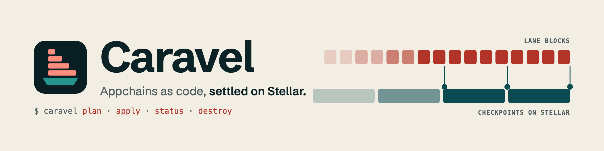
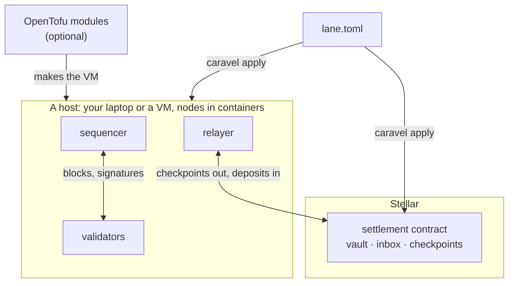

<p align="center">
  <picture>
    <source media="(prefers-color-scheme: dark)" srcset="docs/assets/readme-header-dark.png">
    
  </picture>
</p>

<p align="center">
  <b>Infrastructure as code for Stellar appchains.</b><br>
  Declare a lane in one file. See the plan. Apply it.
</p>

<p align="center">
  <a href="https://github.com/wmendes/caravel/actions/workflows/ci.yml"></a>
  <a href="https://github.com/wmendes/caravel/releases/latest"></a>
  <a href="#license"></a>
  
</p>

<p align="center">
  <a href="https://caravel-docs.vercel.app">Docs</a> ·
  <a href="#quickstart">Quickstart</a> ·
  <a href="https://35-224-76-64.sslip.io">Live lane</a> ·
  <a href="docs/CARAVEL_SPEC.md">Spec</a> ·
  <a href="https://github.com/wmendes/caravel/releases">Releases</a>
</p>

---

Caravel deploys and runs appchains, called **lanes**, that settle to Stellar in the token each one chooses. One lane file declares the lane and every place it runs, and four commands manage it:

| Command | What it does |
|---|---|
| <code>caravel&nbsp;plan</code> | Shows every change on Stellar and on your hosts before anything is sent, down to the settlement contract's address |
| <code>caravel&nbsp;apply</code> | Makes the lane match the file. A second run changes nothing, and an interrupted run finishes on the next one |
| <code>caravel&nbsp;status</code> | Height, checkpoints accepted on Stellar, when a freeze would become possible, and drift from the file |
| <code>caravel&nbsp;destroy</code> | Drains the lane, writes every account's exit proof to `exit.json`, and freezes its contract |

> [!NOTE]
> Testnet software, not audited. See [What this is not](#what-this-is-not).

## Contents

- [How it fits together](#how-it-fits-together)
- [Quickstart](#quickstart)
- [Live on testnet](#live-on-testnet)
- [The lane file](#the-lane-file)
- [Settlement tokens](#settlement-tokens)
- [Deploying to your servers](#deploying-to-your-servers)
- [What this is not](#what-this-is-not)
- [Repository layout](#repository-layout)
- [Documentation](#documentation) · [Contributing](#contributing) · [License](#license)

## How it fits together



Three layers, each with one owner:
- **Machines:** the repository's OpenTofu modules make a VM on Google Cloud ([`infra/opentofu`](infra/opentofu)). You can also use any Linux host you already have.
- **Containers:** each release ships one image per node, the relayer and each web app, for amd64 and arm64. The same images run on a laptop and on a server.
- **The lane:** `caravel` deploys the Stellar contracts, streams the keys, writes the node configs and runs the nodes.

What a lane does:
- **Nodes.** A sequencer and its validators run the lane's engine, a Soroban Wasm, through `soroban-env-host`. Every validator runs every block again itself.
- **Checkpoints.** Each checkpoint goes to the lane's settlement contract on Stellar with its block data, and is accepted only with the validators' threshold signature.
- **Funds.** The lane's token stays in the settlement contract. Withdrawals are Merkle proofs against an accepted checkpoint.
- **Exit.** If the lane stops checkpointing, or ignores deposits and forced withdrawals sent through Stellar, anyone can freeze the contract and take their last checkpointed balance back on Stellar.
- **Replay.** Anyone can rebuild a lane from Stellar data alone and check every state hash.

Two templates ship today, **Caravel Perps** (perpetual futures on an order book) and **Payments** (transfers between lane accounts, with a flat fee). New ones build on the app SDK (`platform/crates/caravel-app-sdk`).

## Quickstart

This brings up a Payments lane on your machine, against a local Stellar network, and uses it.

**You need Docker with Compose.** The lane's nodes run in containers from the release's images, and the local Stellar network runs in one too.

**Install** the latest release, on x86_64 or arm64 Linux and arm64 macOS. It needs no Rust, and it brings the pinned Stellar CLI (28.1.0) if yours isn't that version:

```sh
curl -fsSL https://raw.githubusercontent.com/wmendes/caravel/main/scripts/install.sh | bash
```

The installer puts `~/.caravel/bin` on your PATH for new terminals; to use `caravel` in the one you installed from, run `. ~/.caravel/env`. Pass `--no-modify-path` to manage PATH yourself.

**Run a lane and use it:**

<!-- quickstart: scripts/check-quickstart.sh runs this block as written -->
```sh
caravel init payments my-lane && cd my-lane    # lane.toml, and Stellar CLI identities my-lane-<role>
caravel apply                                  # starts a local network, deploys, runs the nodes
caravel account create alice --amount 100      # XLM from friendbot, a trustline, 100 test USDC
caravel account create bob --amount 10
caravel deposit alice 50                       # returns once the lane has credited it
caravel deposit bob 5
caravel tx --from alice transfer --to @bob --amount 5
caravel balance bob
caravel withdraw alice 10                      # waits for its checkpoint on Stellar, then claims it
caravel status
caravel destroy --yes                          # drain, export every exit to exit.json, freeze
caravel escape alice                           # take the rest back on Stellar
```

Each command finds `lane.toml` in the current directory (or `-f`) and uses its default deployment (or `--env`). Every command takes `--json`. Lane transactions are signed through the Stellar CLI's keystore (SEP-53 message signing), so no key is ever written out.

<details>
<summary><b>All commands, exit codes and the Stellar CLI plugin</b></summary>

<br>

| For | Commands |
|---|---|
| A lane file | `init`, `validate`, `render`, `env list`, `keys list\|ensure\|show`, `output` |
| Running a lane | `plan`, `apply` (both with `--target` and `--replace`; `plan --out FILE`, then `apply FILE`), `graph`, `status`, `destroy`, `stop`, `start`, `restart`, `logs`, `wait`, `api`, `replay`, `doctor` |
| Using a lane | `account create\|fund`, `balance`, `deposit`, `tx`, `withdraw`, `claim`, `force-withdraw`, `escape` |

- **Exit codes:** 0 done, 1 error, 2 usage, 3 changes pending (`plan --exit-code`), 4 a wait timed out.
- **As a Stellar CLI plugin:** the installer also links `stellar-caravel`, so `stellar caravel plan` works too.
- **Without Docker:** `caravel init --runtime process` runs the nodes as local processes; the relayer then needs Node.js 22.

</details>

<details>
<summary><b>Build from a clone instead</b></summary>

<br>

With Rust 1.93 and the `wasm32v1-none` target (both pinned in `rust-toolchain.toml`) and the Stellar CLI 28.1.0 (`cargo install --locked stellar-cli@28.1.0`):

```sh
./scripts/install.sh
```

To run your own changes in containers, build a Linux release and its images from the clone. `scripts/build-linux-release.sh` compiles inside the pinned Rust image, so it works on a Mac too:

```sh
./scripts/build-linux-release.sh /tmp/rel && ./scripts/build-images.sh /tmp/rel
caravel apply --release-dir /tmp/rel
```

`./scripts/e2e-local.sh` runs every step of a lane's life with these commands: user flows, a signer rotation, a forced withdrawal, destroy, escapes and replay. `E2E_TEMPLATE=perps|payments`, `E2E_RUNTIME=process|docker` and `E2E_NETWORK=testnet` choose what it runs.

</details>

## Live on testnet

**Lane #1, Caravel Perps**, has run on Stellar testnet since 2026-09-29, in Circle's testnet USDC. It makes a block every 0.5 s and checkpoints to Stellar every minute. Its nodes and Caddy run as containers on one e2-small VM that OpenTofu describes. Its whole deployment is the `[env.testnet]` table in [`lane.caravel-perps.testnet.toml`](lanes/perps/config/lane.caravel-perps.testnet.toml).

| | |
|---|---|
| Trading app | https://35-224-76-64.sslip.io |
| Lane status | https://35-224-76-64.sslip.io/v1/status |
| Settlement contract | [`CBIHBEUZ…GPONWO`](https://stellar.expert/explorer/testnet/contract/CBIHBEUZYFZQZEQPBJH2ID6CDRDZFEDI6XHAXVOCHG6FO5XWUIGPONWO) |

Measured on that lane with 1 s blocks, before the move to 0.5 s ([`docs/RESULTS.md`](docs/RESULTS.md), 2026-09-29):

| At 45 tx/s for 5 minutes | Result |
|---|---|
| Soft confirmation (receipt on the WebSocket), p50 / p99 | 648 ms / 1,131 ms |
| Hard settlement (checkpoint accepted on Stellar), p50 / p99 | 12.4 s / 19.1 s |
| Stellar fee per 1,000 lane transactions | 0.842 XLM |

A Payments lane also ran its whole life on testnet from a lane file: apply, deposits, a transfer, a validator rotation, a forced withdrawal, destroy, escapes from `exit.json` and replay, in 215 s (2026-09-30).

## The lane file

The lane's own sections define its genesis: `[lane]`, `[app]`, `[node]`, `[access]`, `[limits]` and the template's table. They are consensus config and stay literal. Each `[env.<name>]` table is one deployment of the lane, and deployments are where the language is: vars, locals, `${…}` expressions, `extends`, `include`, `for_each` and outputs.

```toml
[vars.validators]
type = "list"
default = ["1", "2", "3"]

[env.base]
abstract = true                                # only for extending
admin = "acme-admin"                           # a Stellar CLI identity; keys never go in the file
threshold = "${length(var.validators) / 2 + 1}"
relayer = { account = "acme-relayer" }

[env.base.validators]                          # one validator per name
for_each = "${var.validators}"
name = "${each.value}"
key = "acme-v${each.value}"

[env.local]
extends = "base"
default = true
network = "local"                              # or "testnet"; mainnet is refused
token = { local = "USDC" }
host = { provider = "local", runtime = "docker" }

[env.testnet]
extends = "base"
network = "testnet"
token = "circle-usdc"
host = { provider = "ssh", runtime = "docker", address = "deploy@lane.example", public_url = "https://lane.example" }

[outputs]
settlement = "${contract.settlement.address}"
```

`caravel apply --var 'validators=["1","2","4"]'` then replaces validator 3, and `caravel output settlement` prints the contract's address.

- **Applied as a step:** a validator swap becomes a signer rotation, and a `[node]` setting becomes a restart.
- **Refused:** anything the settlement contract fixed at deploy (the lane's rules, the engine, the admin, the token, the settlement params). For those, destroy the lane or give it a new name.

There is no state file. The lane file and the chain are the whole truth, and `plan` reads both. The full reference is [on the docs site](https://caravel-docs.vercel.app/reference/lane-file).

## Settlement tokens

A lane settles in the token its `[env]` names:

| `token =` | Settles in |
|---|---|
| `"circle-usdc"` | Circle's testnet USDC |
| `{ asset = "USDC:GBBD47IF…LLFLA5" }` | Any Stellar asset, through its Stellar Asset Contract. `apply` deploys that contract when the network has none |
| `{ contract = "CBIELTK6…DAMA" }` | Any SEP-41 token contract |
| `{ local = "USDC" }` | A test asset issued by the admin, on a local network |
| `"usd"` | A token the deployment declares ([`[env.<name>.tokens.usd]`](https://caravel-docs.vercel.app/reference/lane-file/accounts-and-tokens#declared-tokens)) |

What a token must do:
- **Move exact amounts.** A token that charges a fee on transfer, or rebases, would break the vault's accounting, and the tool can't check that.
- **Its issuer's rules still apply.** A freeze or clawback reaches the contract's balance too.
- **Decimals.** Perps arithmetic is in 10^-7 units, so a Perps lane needs a 7-decimal token (every Stellar asset has 7). Payments takes any decimals.

## Deploying to your servers

Add an `[env.testnet]` table with an ssh host, and the same `plan` and `apply` run it there.

| Step | How |
|---|---|
| **A machine** | Any Linux host over ssh with passwordless `sudo`. On Google Cloud, `infra/opentofu` makes one with Docker, and `tofu output -raw caravel_vars > hosts.vars.toml` hands its address to the lane file (`--var-file hosts.vars.toml`). See [Machines on Google Cloud](https://caravel-docs.vercel.app/guides/machines-on-gcp) |
| **How nodes run** | `runtime = "docker"` (the host needs only Docker), or systemd units on a host set up by [`provision.sh`](lanes/perps/deploy/testnet/provision.sh) |
| **Reaching it** | ssh, or `gcloud compute ssh --tunnel-through-iap`. Keys stream over the connection into mode-600 files and never touch your disk |
| **The Wasm of record** | `--wasm-dir` with the `contracts-wasm` artifact CI builds for each commit (hashes of record are x86_64 Linux builds) |
| **Operations** | Releases, rotations and recovery: [`docs/RUNBOOK.md`](docs/RUNBOOK.md) |

## What this is not

- **Not trustless.** If a threshold of validators collude with the sequencer, they can sign a wrong state. Replay detects this but can't prevent it.
- **Stellar validators don't run lane blocks.** They check signatures and store the data. Lane blocks aren't Stellar transactions, and a lane's block time is its own.
- **Not audited, not production, not mainnet.** On testnet, a lane's admin can still upgrade its settlement contract and rotate its validators, and lane #1's three validators run on one machine operated by the Caravel team.
- **Caravel doesn't make machines.** It deploys onto hosts that exist; the OpenTofu modules are a separate step.

## Repository layout

| Path | Contents |
|---|---|
| `platform/crates/caravel-cli` | `caravel`, the one CLI for every template |
| `platform/crates/caravel-deploy` | The deploy library: plans, the local and ssh providers, the process, systemd and docker runtimes, chain reads, user flows |
| `platform/crates/caravel-lanefile` | The lane file language: include, extends, vars, expressions |
| `platform/crates/caravel-node` | Sequencer, validator, replay and genesis for any app |
| `platform/crates/caravel-runtime` | Executor, store, sequencer and validator cores |
| `platform/crates/caravel-core`, `caravel-app-sdk` | The formats every lane shares, and the `no_std` SDK for lane engines |
| `platform/contracts/settlement` | The settlement contract: vault, inbox, checkpoints, freeze, escape |
| `platform/relayer` | Posts inbox entries and checkpoints to Stellar, and hosts feed modules |
| `lanes/perps`, `lanes/payments` | The two templates: engines, nodes, Caravel Perps' trading app and oracle feed |
| `docker/` | The release's container images |
| `infra/opentofu/` | Machines as code for Google Cloud |
| `scripts/` | Build, check, release, deploy and end-to-end scripts |
| `docs-site/`, `site/` | The docs and the landing page |

## Documentation

| | |
|---|---|
| [The docs](https://caravel-docs.vercel.app) | Getting started, concepts, guides, the lane file and the CLI reference |
| [`docs/CARAVEL_SPEC.md`](docs/CARAVEL_SPEC.md) | The specification, the source of truth, with every design decision in §22 |
| [`docs/RUNBOOK.md`](docs/RUNBOOK.md) | Operating a lane, lane #1 included |
| [`docs/RESULTS.md`](docs/RESULTS.md), [`docs/BENCHMARKS.md`](docs/BENCHMARKS.md) | Measured results on testnet, and engine benchmarks at full caps |
| [`docs/SECURITY.md`](docs/SECURITY.md) | The security review and its findings |
| [`docs/SOURCES.md`](docs/SOURCES.md) | Where each Stellar fact and prior-art idea comes from |

## Contributing

See [`CONTRIBUTING.md`](CONTRIBUTING.md) for the workflow, the checks every change must pass, and what CI runs for which change.

## License

Licensed under either of the [Apache License, Version 2.0](LICENSE-APACHE) or the [MIT license](LICENSE-MIT), at your option. Unless you state otherwise, any contribution you intentionally submit for inclusion in this work, as defined in the Apache-2.0 license, is dual licensed as above, without any additional terms or conditions.
